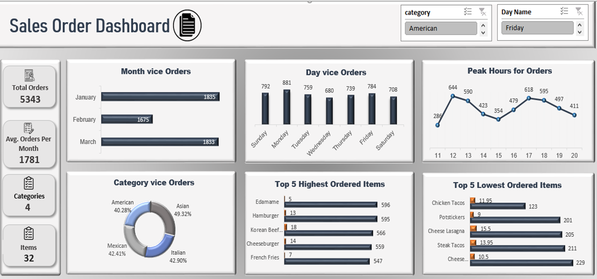
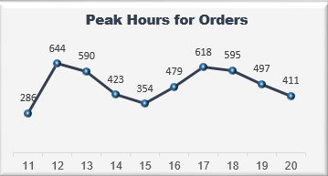
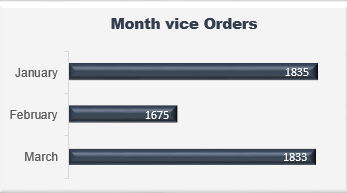
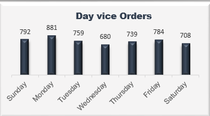
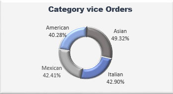
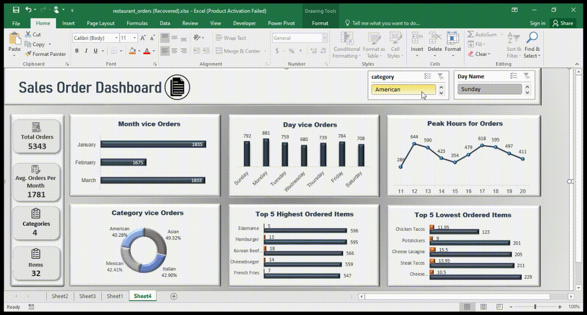

# Sales Order Analysis Dashboard

# Overview
This project involves the creation of a Sales Order Dashboard in Excel, designed to provide detailed insights into sales data through various visualizations. The dataset has undergone significant pre-processing to ensure it is clean and ready for analysis, using Power Query for data transformations.

## Steps Involved in the Data Preprocessing

### 1. Handling Null Values
- **Null Value Check**: The dataset was thoroughly inspected for missing or null values.
- **Action Taken**: Any null values were removed based on the context of the column.

### 2. Correcting Data Types
- **Problem**: Some columns in the dataset had incorrect data types that could hinder analysis (e.g., dates stored as text or numbers stored as text).
- **Action Taken**: 
  - Corrected data types for relevant columns using Power Query.
  - Ensured columns like order_date was recognized as date types, and  order_time was correctly formatted as time.

### 3. Creating New Columns for Analysis
- **Day Column**: A new column was created to extract the day of the week from the order_date to allow easier sorting and filtering by specific days.
- **Month Column**: A column for the month was added to facilitate time-based trend analysis.

### 4. Sorting Days by Day of the Week
- **Problem**: The day column was initially sorted alphabetically, which did not provide meaningful insights for the user.
- **Action Taken**: The Days of the Week column was sorted chronologically to enable easier analysis by the actual sequence of the days.

### 5. Power Query Transformations
- All the above data transformations (null value handling, data type correction, new column creation, sorting) were performed using Power Query to automate the process and ensure future datasets can be processed in a similar manner.

## Visualizations Included in the Dashboard
The Sales Order Dashboard not only provides a clean and structured analysis of the data but also incorporates several powerful visualizations to communicate key trends effectively. These include:
- **Line Chart**: Displays trends over time, showcasing sales growth  or decline over different hours of  the day.
 

- **Bar Chart**: Used to compare orders across different months.
 

- **Column Chart**: Provides a clear view of the comparison between sales orders in different days of the week.
 

- **Donut Chart**: Offers a breakdown of sales orders by categories highlighting proportional distributions in an intuitive way.
 

These charts offer interactive filtering and sorting features, allowing users to easily explore and analyze data in a meaningful way.

## Final Step: GIF of Dashboard Functionality
Below is a demonstration of the functionality of the Sales Order Dashboard. The GIF showcases how the dashboard operates and how different filters and sorting options can be applied to analyze the data.

## Conclusion
This Sales Order Dashboard provides valuable insights into sales trends, offering a clean and organized way to view and analyze sales order data. The data transformations performed through Power Query ensure that the dashboard works seamlessly for both current and future datasets. Additionally, the diverse visualizations included in the dashboard showcase the ability to present data effectively, making it easy for stakeholders to interpret and act on the insights provided.
